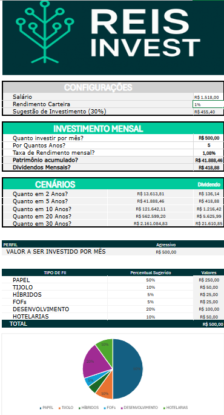

📊 Investment Control - Excel Dashboard

Planilha de Controle de Investimentos desenvolvida no Microsoft Excel, focada em organização, acompanhamento e análise de ativos financeiros.

🖥️ Exemplo de Tela - Dashboard da Planilha

✅ Funcionalidades Principais

- Registro detalhado de investimentos
- Acompanhamento de rentabilidade
- Consolidação de aportes
- Análise de saldo acumulado
- Painel de controle (Dashboard) para visão geral
- Lista de ativos e categorias customizáveis (via tabela de apoio)

🗂 Estrutura da Planilha

**APP** --> Interface principal com registros, cálculos e gráficos.

**TBL_APOIO_APP** --> Tabela de apoio para parametrizações, listas suspensas, categorias de ativos, etc.

🎯 Tecnologias e Recursos Usados

- Microsoft Excel (.xlsx)
- Fórmulas avançadas
- Validação de dados
- Tabelas dinâmicas e gráficos
- Estrutura modular com separação de dados e interface

🚀 Como Usar

1. Baixe o arquivo: [`investment-control.xlsx`](./investment-control.xlsx)
2. Abra no Excel (versões recomendadas: 2016, 2019, Office 365 ou superior)
3. Na aba **APP**, comece a inserir seus investimentos.
4. Caso queira adicionar novas categorias ou tipos de ativo, edite a aba **TBL_APOIO_APP**.

✅ Requisitos Mínimos

- Microsoft Excel 2016 ou superior
- Habilitação de macros (se futuras versões incluírem VBA)
- Conhecimento básico de Excel (digitação de dados e navegação entre abas)

🛠 Possíveis Melhorias Futuras

- Inclusão de gráficos dinâmicos
- Automação com VBA
- Exportação para PDF
- Dashboard com indicadores chave (KPIs)
- Integração com fontes externas de cotação (via Power Query ou APIs)

📌 Licença

Projeto pessoal de código aberto.  
Sinta-se livre para clonar, adaptar e melhorar.  
**Se usar publicamente, dê os devidos créditos.**

✍️ Autor

Desenvolvido por **Mateus Reis**.

🏅 Origem do Projeto

Este projeto foi desenvolvido como parte das atividades do **Santander - Excel com Inteligência Artificial, em parceria com a DIO**, com adaptações e melhorias pessoais feitas por mim.

